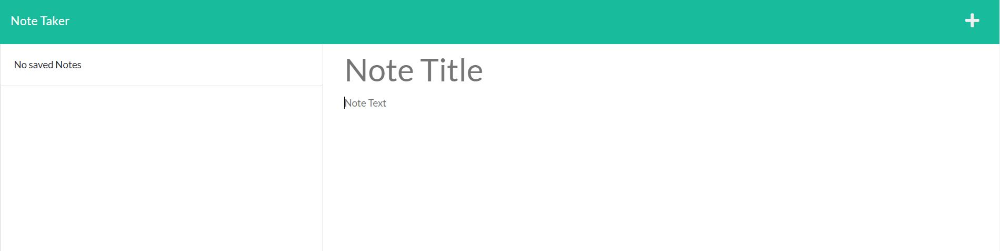

# Note taker
  ## Table of contents
  * [Description](#Description)
  * [Usage](#Usage)
  * [Technology](#Technology)
  * [Questions](#Questions)
  * [Contact](#Contact)

  ## Description
  This is my note taker app, it's meant to show that I'm able to create an app that will do the following. Log a users notes to a JASON file and demonstrate a serverless project as it is hosted on Heroku.
 
  ## Usage
  visit the deployed site on heroku here and take some notes if you like!

  
  
  ## Technology
  This app used the following Technology Javascript, Node.js, HTML, CSS, Express, Heroku and bootstrap. 
  
  ## Questions
  If you have any questions feel free to contact me at the links below.
  
  ## Contact
  [linked in](https://www.linkedin.com/in/cedar-halvorson-10791020a/)
  
  [github profile](https://github.com/CedarHalvorson)  
  
  Email cedarhalvorson@gmail.com 